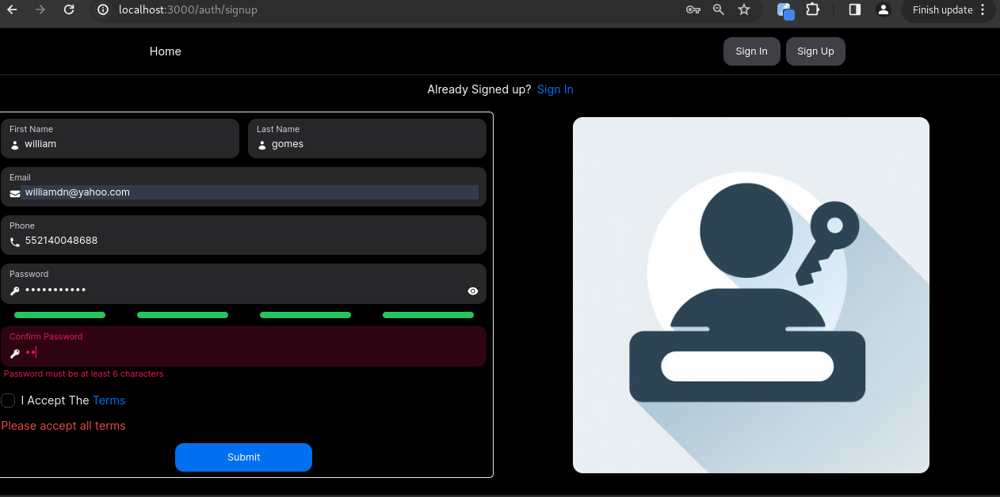
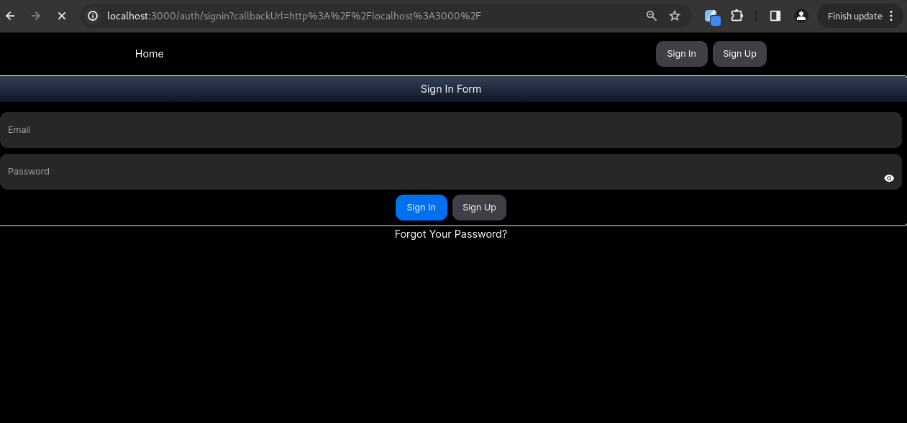
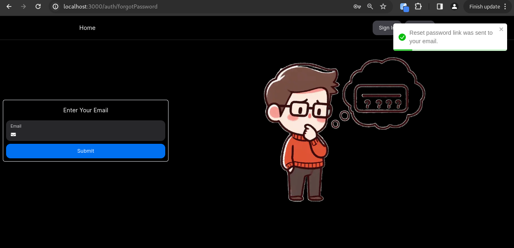
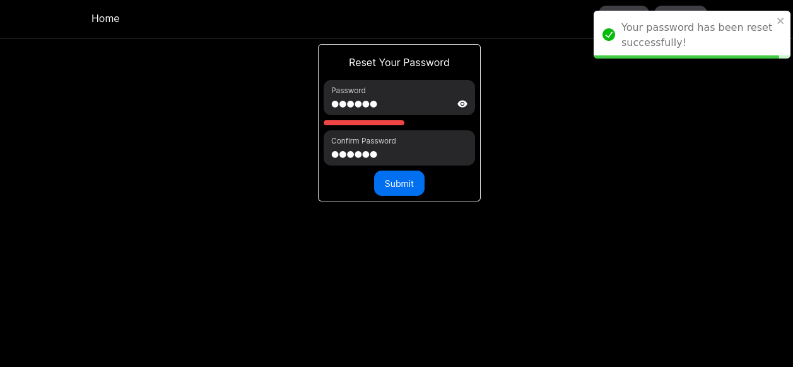
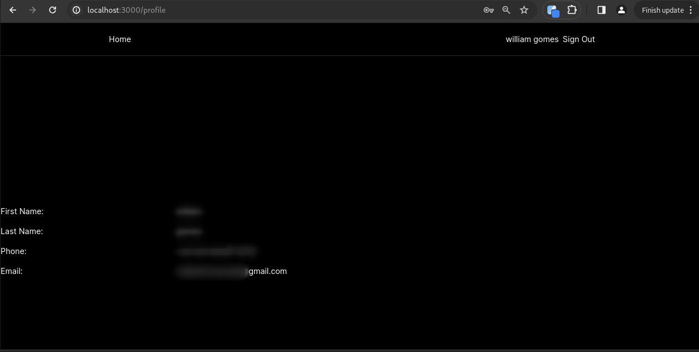
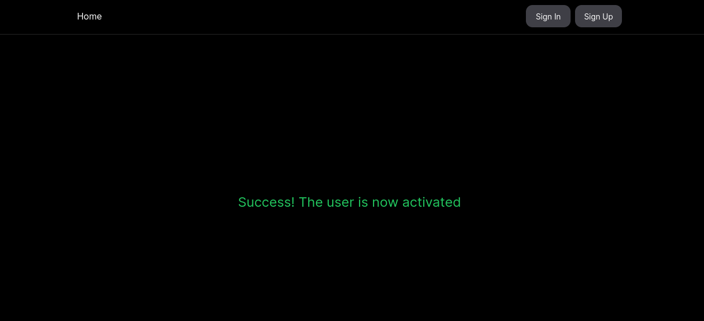
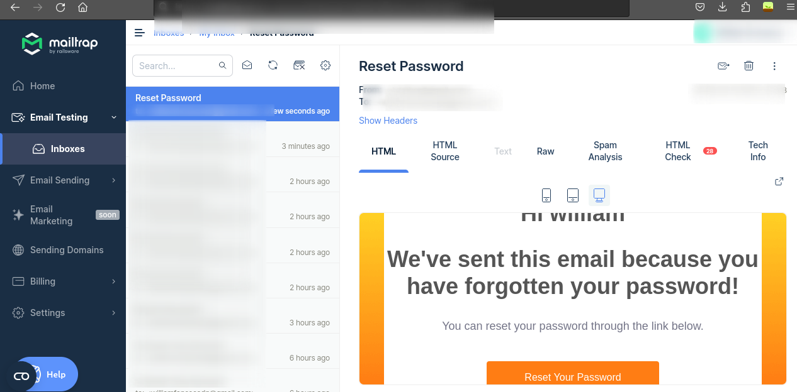
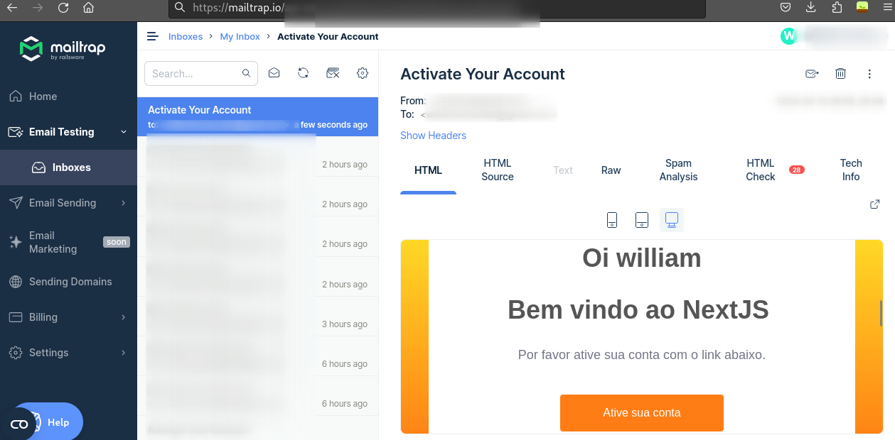

<h1 align="center">Fluxo completo de login, cadastro, ativar email e resetar senha - Next14 (NextJS, Prisma, Hookform, Zod, JWT, Nodemailer, Toastify and more... )</h1>

<p align="center">
  

  

  
  
  <a href="https://github.com/williamjayjay/Github-Blog/commits/master">
    
  </a>
    
   <a href="https://github.com/williamjayjay/nextjs14-auth-sign-signup-password-mailprovider-middleware/stargazers">
    
  </a>
</p>

<p align="center">Vamos construir juntos um fluxo de login,cadastro, reset de senha e ativação de email utilizando NextJS tanto no front quanto no back.<br/><strong>Está é apenas uma POC de um fluxo completo de autenticação usando nextjs</strong>.</p>

<p align="center">

</p>

## 🥶 Sobre o projeto

Desenvolvi esse projeto para reforçar meu conhecimento no fluxo de autenticação e proteção de rotas no nextjs.

## Página Web:

**Web:** O front desenvolvido com NextJS, utiliza estilos com tailwind e os componentes com a biblioteca nextui.


## 🚀 Tecnologias

Principais tecnologias que utilizei para desenvolver esta aplicação

- [NextAuth](https://next-auth.js.org/)
- [TailwindCSS](https://tailwindcss.com/)
- [Heroicons](https://heroicons.com/)
- [NextUI](https://nextui.org/)
- [Prisma](https://www.prisma.io/)
- [Check-Password-Strength](https://www.npmjs.com/package/check-password-strength)
- [HandlebarsJS](https://handlebarsjs.com/)
- [JsonWebtToken](https://www.npmjs.com/package/jsonwebtoken)
- [Nodemailer](https://www.nodemailer.com/)
- [Zod](https://zod.dev/)
- [React-Hook-Form](https://react-hook-form.com/)
- [React Toastify](https://www.npmjs.com/package/react-toastify)

## Guia de inicialização

Para instalar e configurar uma cópia local, siga estas etapas simples:

### Prerequisitos

Para garantir o funcionamento adequado da nossa aplicação, verifique abaixo:

1. **Clone o repositório**:
   ```sh
   git clone https://github.com/williamjayjay/nextjs14-auth-sign-signup-password-mailprovider-middleware
   ```

2. **Rodar a migration:** Rode a migration do sqlite para gerar o schema do banco.
   ```sh
   bunx prisma migrate dev --name first migration
   ``` 

3. **Instale os módulos:**
  ```sh
  bun i
  ```

4. **Copie o .env de exemplo:** 

5. **Gerar credênciais mailtrap:** Gere o USER e PASS no exemplo com mailtrap através deste [link aqui](https://mailtrap.io)

6. **Gere ou crie os tokens NEXTAUTH_SECRET e JWT_USER_ID_SECRET** 

7. **Rodar a aplicação:**
  ```sh
  bun dev
  ```

## Roadmap

- [x] Cadastrar usuário.
    - [x] Autenticar no email(no nosso exemplo com mailtrap).

- [x] Fazer login.

- [x] Resetar a senha.

- [x] Proteger a rota /profile para permitir acesso apenas usuários com sessão ativa.

- [x] Funcionamento do middleware para forçar o direcionamento á rota de login, quando a rota profile for acessada sem sessão ativa.

- [x] Manter sessão ativa.

- [x] Permitir deslogar usuário.

- [x] Senha e Token do email criptografados.


## WEB UX
UI e UX feita de forma simplista, foco da aplicação consiste em si na regra e no fluxo da api em NEXTJS.


| Página de Entrada (SignIn) | Página de Cadastro (SignUp) |
|:-------------------------:|:-------------------------:|
|  |  |

| Página de Recuperação de Senha (Forgot Password) | Página de Redefinição de Senha (Reset Password) |
|:-------------------------:|:-------------------------:|
|  |  |

| Página de Perfil (Profile) | Email de Ativação |
|:-------------------------:|:-------------------------:|
|  |  |

| Email de Redefinição de Senha - MailTrap | Email de Ativação - MailTrap |
|:-------------------------:|:-------------------------:|
|  |  |
